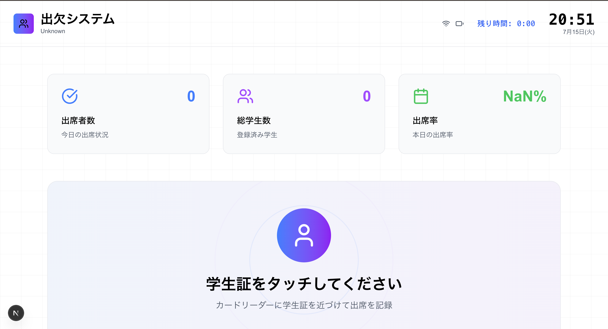
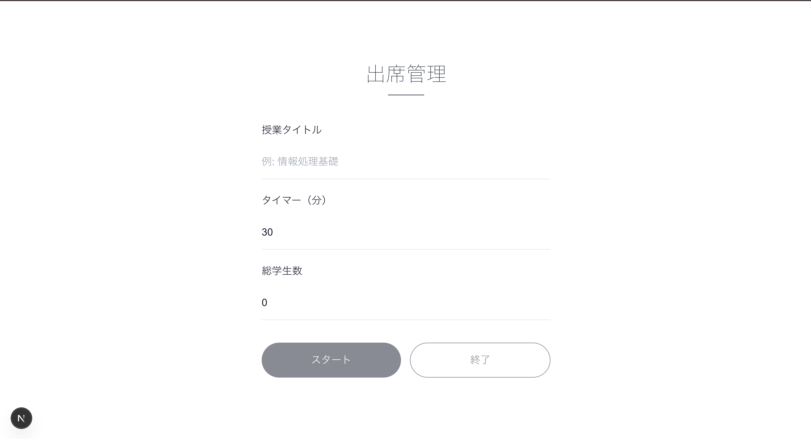

# Student Attendance System / 学生出席システム

## Screenshots / スクリーンショット

| Student Page | Admin Page |
|:------------:|:----------:|
|  |  |

---

# English

## Features

- **Student Attendance (Main Page)**
  - Register attendance by "tapping" a student card (simulated)
  - View a list of registered students
  - Animated feedback for successful/failed attendance
  - Attendance data is persisted in sessionStorage
- **Admin Page (`/admin`)**
  - Password authentication (set via `.env` as `NEXT_PUBLIC_ADMIN_PASSWORD`)
  - Input class title, timer (minutes), and total number of students
  - Timer management (real-time countdown, auto-close attendance on timeout)
  - After attendance closes, view registered students and download CSV
  - CSV filename format: `YYYYMMDD_ClassName_attendance.csv`
- **State Management**
  - All class/session/attendance/auth data is managed in sessionStorage
  - Data persists across reloads and navigation within the same tab
- **UI/UX**
  - Smooth animations with framer-motion
  - lucide-react icons
  - Stylish input UI and statistics cards

---

## Setup

1. **Install dependencies**

   ```bash
   npm install
   # or
   yarn install
   ```

2. **Set environment variables**

   Create your own `.env` file in the project root and set the admin password as follows:

   ```env
   NEXT_PUBLIC_ADMIN_PASSWORD=your_admin_password
   ```
   (Replace `your_admin_password` with your desired password.)

3. **Start the development server**

   ```bash
   npm run dev
   # or
   yarn dev
   ```

4. **Access the app**
   - Student page: `http://localhost:3000/`
   - Admin page: `http://localhost:3000/admin`

---

## Usage

### Admin Page (`/admin`)
1. Log in with the password
2. Enter class title, timer (minutes), and total number of students
3. Click "Start" to begin attendance (redirects to `/`)
4. Attendance closes automatically when the timer ends or by clicking "End"
5. View registered students and download the CSV file

### Student Page (`/`)
- Tap the student card (or use the simulation button) to register attendance
- Animated feedback for success/failure
- View the list of registered students
- Automatically redirects to `/admin` when the timer ends

---

## CSV Export Format
- Filename: `YYYYMMDD_ClassName_attendance.csv` (e.g., `20240608_InformationBasics_attendance.csv`)
- First row: Class name, total students, attendance rate, first student ID
- Subsequent rows: Only student IDs

---

## Notes
- This system is **frontend-only**; there is no backend or database.
- Data is managed in sessionStorage, so it only persists within the same browser tab.
- Password and class/session info are managed via `.env` and sessionStorage.
- The test "Success/Fail" buttons for attendance are for development only—remove them for production.

---

## Technologies Used
- Next.js (App Router, TypeScript)
- framer-motion
- lucide-react
- Tailwind CSS

---

## License
MIT

---

# 日本語

## 主な機能

- **出席登録（学生ページ）**
  - 学生証をタッチして出席登録（シミュレーション）
  - 登録済み学生一覧の表示
  - 出席成功/失敗のアニメーション表示
  - 出席データは sessionStorage で永続化
- **管理者ページ（/admin）**
  - パスワード認証（.env の `NEXT_PUBLIC_ADMIN_PASSWORD` で設定）
  - 授業タイトル・タイマー（分）・総学生数の入力
  - タイマー管理（残り時間のリアルタイム表示、終了時に自動で出席締切）
  - 出席登録完了後、登録学生一覧とCSVダウンロード
  - CSVファイル名は「日付_クラス名_attendance.csv」形式
- **状態管理**
  - sessionStorage で授業情報・出席データ・認証状態を管理
  - ページリロードや遷移でもデータが保持される
- **UI/UX**
  - framer-motion によるアニメーション
  - lucide-react アイコン
  - スタイリッシュな入力UI・統計カード

---

## セットアップ

1. **依存パッケージのインストール**

   ```bash
   npm install
   # または
   yarn install
   ```

2. **環境変数の設定**

   プロジェクトルートに**自作で `.env` ファイルを作成し、下記のように管理者パスワードを記述してください：**

   ```env
   NEXT_PUBLIC_ADMIN_PASSWORD=your_admin_password
   ```
   （`your_admin_password` を任意のパスワードに変更してください）

3. **開発サーバーの起動**

   ```bash
   npm run dev
   # または
   yarn dev
   ```

4. **アクセス**
   - 学生ページ: `http://localhost:3000/`
   - 管理者ページ: `http://localhost:3000/admin`

---

## 使い方

### 管理者ページ（/admin）
1. パスワードでログイン
2. 授業タイトル・タイマー（分）・総学生数を入力
3. 「スタート」で出席受付開始 → `/`（学生ページ）に遷移
4. タイマー終了または「終了」ボタンで出席締切
5. 登録学生一覧とCSVダウンロードが可能

### 学生ページ（/）
- 学生証をタッチ（シミュレーションボタンあり）で出席登録
- 出席成功/失敗のアニメーション表示
- 登録済み学生一覧の確認
- タイマー終了時は自動で `/admin` にリダイレクト

---

## CSVエクスポート仕様
- ファイル名: `日付_クラス名_attendance.csv`（例: 20240608_情報処理基礎_attendance.csv）
- 1行目: クラス名, 総人数, 出席率, 最初の学籍番号
- 2行目以降: 学籍番号のみ

---

## 注意事項
- 本システムはフロントエンドのみで動作します。**バックエンドやDBはありません**。
- データは sessionStorage で管理されるため、**同じブラウザ・タブ内でのみ永続化されます**。
- パスワードや授業情報は .env および sessionStorage で管理されます。
- テスト用の「出席成功/失敗」ボタンは本番運用時は削除してください。

---

## 使用技術
- Next.js (App Router, TypeScript)
- framer-motion
- lucide-react
- Tailwind CSS

---

## ライセンス
MIT
